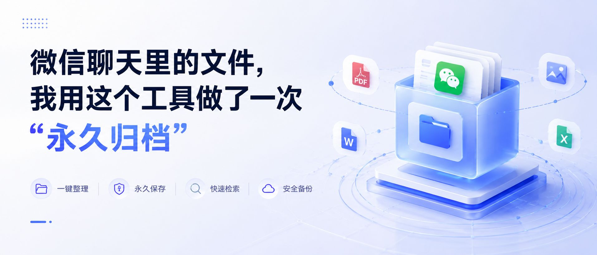

> 远舟笔记 · 第5篇

---

上周筹备活动，领导说："去年那版方案你找一下。"

我心想，简单，翻聊天记录嘛。

结果翻了40分钟。

从"方案终稿"翻到"方案终稿2"，再到"方案终稿定版""方案终稿定版不改了"——你没猜错，文件全部过期，一个都打不开。

那一刻我突然意识到一件事：

**微信不是文件夹，它是条河。**

所有文件都在水上漂着，你以为它在，其实它一直在顺流而下。7天、30天、90天，迟早被冲走。

而我们要做的，是在岸边建一个仓库。

---

## 1. 从河里捞鱼——聊天文件一键归档

腾讯IMA知识库，就是我找到的那个仓库。

它跟别的工具最大的不同，是能**直接从微信聊天里捞文件**，不用先下载到手机再上传。

操作很简单：

1. 打开IMA知识库小程序
2. 点击「+」→「从微信导入」
3. 批量勾选聊天里的文件、图片
4. 确认存入

就这么几步，群里散落的合同、报价单、设计稿，一口气打包上岸。

**存进去的文件，永远不会过期。**

这解决的是最基本的问题：东西别丢了。

---

## 2. 顺手抄个鱼谱——公众号文章随手存

存完了自己的文件，还有一类东西也在悄悄溜走：**你刷到的好文章。**

公众号文章收藏了等于没收藏——收藏夹是个黑洞，进去就出不来了，你不会再去翻的。

IMA可以当手机端的轻量收藏站：

1. 打开任意公众号文章
2. 右上角「...」→「更多打开方式」→ IMA知识库
3. 自动存入

不需要装插件，不需要懂Markdown，在微信里顺手就完成了。

如果你在用Obsidian（第2、4篇聊过），IMA就是手机端的中转站——刷到好内容先存IMA，回到电脑再同步到Obsidian做体系化管理。

---

## 3. 给鱼贴标签——纸质文件也能变可搜文本

到这里你可能觉得：电子文件能搞定，纸质的呢？

合同签字页、会议手写笔记、客户名片……这些还在抽屉里吃灰。

IMA有个功能让我意外：**拍照识字。**

1. IMA小程序 →「+」→「拍照导入」
2. 对准纸质文件拍一张
3. 自动OCR识别，变成可搜索的文字

这意味着什么？

照片会模糊，但**文字一旦被识别出来，就永远不会消失。**

---

## 4. 问仓库管理员——不用翻，直接问

存了这么多东西，怎么找到需要的那一条？

这是最让我觉得"来了来了"的功能。

IMA内置AI问答，你可以直接用自然语言问它：

> "我存过哪些合同相关的文件？"

> "上次从工作群导入的图片里，有没有'方案'这两个字？"

它不是在文件名里搜关键词，是**真的读懂了内容再回答你**。

以前找文件：翻聊天→翻收藏→翻相册→放弃。

现在找文件：问一句→直接拿到。

---

## 仓库建好了，河还在流

微信不会帮你永久保存文件，这是它作为聊天工具的本性——它就是河，不是仓库。

IMA做的事情很简单：帮你把河里的东西捞出来，存进仓库，贴好标签，还能随时问管理员要。

文件不会过期，图不会变模糊，想找什么直接问。

如果你也被微信文件过期折磨过，建议试一下——**建个仓库，别再指望那条河了。**

---

## 📌 一个小互动

你有没有文件过期打不开的惨痛经历？评论区聊聊，比比谁更惨 👇

---

*我是远舟，在AI时代摸索成长的一名文案写手。被微信文件过期折磨了三年，终于找到了解药。*
