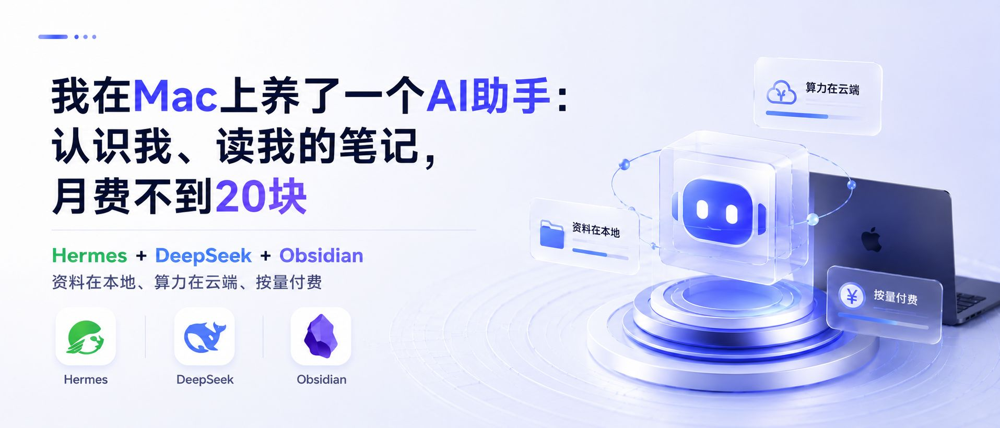

**标题**：我在Mac上养了一个AI助手：认识我、读我的笔记，月费不到20块

**副标题**：Hermes + DeepSeek + Obsidian，资料在本地、算力在云端、按量付费


---

我以前用 AI 最大的挫败感，不是它不聪明，而是它不认识我。

我花了很多时间跟它解释：我是谁、我写什么、我关心什么、我喜欢什么表达方式。可下一次打开，它又像第一次见我。

一个不会成长的 AI，再强也只是临时工。

所以我最近在 Mac 上搭了一套自己的 AI 助手：资料放在本地 Obsidian，模型用 DeepSeek API，外面套一层 Hermes Agent。它能读我的笔记，记住我的偏好，用多少花多少。这个月我充了 20 块，到现在还没用完。

我知道，看到这里你可能觉得"终端、开源、CLI"是程序员的东西。别急，看完你会发现它比你想象的简单。

---

## 一、三个拦路虎

先说说我卡在哪。

**第一关：魔法。** ChatGPT、Claude，东西是好，但你打不开那个网页。就算打开了，注册要海外手机号，付费要外币信用卡。折腾一圈下来，AI 还没用上，先把自己搞累了。

**第二关：会员费。** 不求人，用国产的吧。开一个会员 ¥30，再开一个 ¥60。但你有没有发现——你开的每个 AI 都是独立的，A 不知道你在 B 里问过什么。而且不管你这个月用得多还是用得少，会员费一分不少。

**第三关：AI 不认识你。** 这是最要命的。你跟它聊了三个月，它还是记不住你写过什么、关心什么领域、喜欢什么表达方式。每次对话都像跟陌生人说话——你自我介绍一次，它忘一次。

这三个问题卡住了大多数人。不是 AI 不好用，是**用起来的门槛和成本**让大多数人止步了。

---

## 二、先说说我现在怎么用

装好之后，我实际用它做了这些事：

**翻笔记。** 我在 Obsidian 里攒了上百篇笔记。以前找一篇文章，要回忆文件名、翻文件夹。现在直接问它："我记得我收藏过一篇关于工作流的文章，讲的是什么？"它去 Obsidian 里翻一遍，直接告诉我。

**按我的风格改稿。** 它知道我习惯用的表达方式、段落长度、语气偏好。写方案时我只需要口述要点，它出框架我来改，省了一大半时间。

**记住我的背景。** 我跟它聊过我的工作、我关心的领域，它不会忘。下次再问相关的问题，不用重新交代上下文。

这些事听起来不大，但累积起来，每天省下的重复劳动非常可观。

---

## 三、破局：找到了一条国内直连的路线

先说我现在的方案长什么样：

```
你（终端）→ Hermes Agent → DeepSeek API
                          ↓
                     Obsidian 知识库（本地硬盘）
                          ↓
                     记忆系统（存档你的偏好）
```

Hermes Agent 是一个开源终端 AI 助手，它像是一个"大脑的容器"。DeepSeek 是这个容器里负责思考的引擎。Obsidian 是你存在本地的资料库。三者组合，成了一个**认识你、能调用你资料、不需要魔法、按量计费**的 AI 助手。

关键是：**装好后你就是打字聊天，不需要写一行代码。**

---

## 四、费用账本

| 项目 | 月费 |
|------|------|
| Hermes Agent | **¥0**（开源免费） |
| DeepSeek API | **¥15-25**（按量计费） |
| **合计** | **≈ ¥20/月** |

对比一下：

| 方案 | 月费 | 认识你吗？ | 能换模型吗？ |
|------|------|-----------|------------|
| ChatGPT Plus | ¥145 + 魔法 | ❌ 每次都重新来 | ❌ 被绑定 |
| 国产AI会员（单个） | ¥30-60 | ❌ 每个都不认识你 | ❌ 换平台从头来 |
| **Hermes + DeepSeek** | **¥20** | **✅ 记住你是谁** | **✅ 随时换** |

关键差异在最后两列——**认识你**和**能替换**。

---

## 五、不成长的AI，就是每次都跟陌生人说话

这是最核心的区别。

你用 ChatGPT，这周问它"帮我整理一下知识库的框架"；下周问它"你对我的工作流有什么建议？"——它不认识你，它不知道你上周做过什么，不知道你的知识库里有什么。

你用 Hermes：

- 它有**记忆系统**，会存档你的偏好、习惯、背景信息
- 它可以**读你的 Obsidian 知识库**，基于你的资料回答问题
- 它有**技能系统**，踩过的坑、学到的经验会沉淀下来，下次自动加载

你用一个月，它对你的了解就多一分。你用一个季度，它已经知道你的思考习惯、你关心的领域、你喜欢的表达方式。

**这套方案启动门槛低，长期使用费用不高，而且它会一直成长。**

---

## 六、不怕被绑定，随时换模型

这是另一个很多人忽略的点。

你用任何一个 AI 产品——你是被绑定在那个厂商的。它涨价你只能受着，它功能更新慢了你也只能等着，哪天它服务调整了你更被动。

在这个方案里，你用的是**你自己的 AI 助手，只是恰好用了 DeepSeek 的脑子**。

明天出了更好的国产模型？换。
后天小米 MiMo 更便宜？换。
哪天有本地模型能跑在自己电脑上了？换。

改一行配置的事。你的记忆、你的技能、你的 Obsidian 知识库——全都在，不受影响。

**你养的助手是你的，换什么脑子你自己说了算。**

---

## 七、不需要会编程

我知道 "终端""CLI""开源" 这几个词可能会劝退人。

但你想象一下：装好之后，你就是在终端里打字跟它聊天，跟你在微信里打字一样。

- 想让它帮你整理思路 → 直接说
- 想让它去 Obsidian 里找一篇文章 → 直接说
- 想让它查资料、写总结 → 直接说

**不需要会编程，但需要愿意照着提示复制几条命令，遇到报错也别慌。** 我装的时候也从下午折腾到晚上，报错贴给 AI 看，一轮一轮才搞定。

---

## 八、资料在本地，计算用云端——对新手最友好

有一个问题可能你已经想到了：这个方案不是本地模型，用的是 API 接口，需要把问题发到 DeepSeek 的服务器去计算，这不也算"上云"吗？

算是，也不是。

**你的资料存在本地**——Obsidian 里的所有笔记、剪藏、知识库，都在你自己的硬盘上，我的 Obsidian 不会整库上传到任何平台。

**计算在云端完成**——当我要 AI 基于某些资料回答问题时，相关内容会被发送到模型服务器计算。敏感资料仍然需要自己把关。

那为什么说这反而是个好事情？

**因为你不挑机器。** 你的电脑不需要有强大的显卡，不需要 32GB 内存，不需要跑什么大模型。一台普通的 MacBook Air 就能跑。我用的就是公司配的普通 MacBook，没加配任何硬件。

对比一下本地模型的路子：
- 想跑一个好一点的模型？先买一块 ¥5000+ 的显卡
- 显存不够？换更大显存的卡
- 模型跑起来了，手机能用吗？还得再搭一套远程方案

这不是对新手友好，这是对新手设门槛。

**API 模式最友好的地方就是——你只管用，算力的事交给服务器。**

一台几千块的普通笔记本，配上 ¥20/月的 API 费用，效果约等于一台几万块的本地工作站。

所以这个方案的正确理解是：**资料在自己手里，算力交给云端，你只关注业务本身。**

---

## 九、macOS 搭建（按需参考）

我在 MacBook 上搭的，纯命令行操作，国内网络可直连。跟着走就行。

### 安装 Hermes

两条路，选一条：

```bash
# 方式一：官方脚本安装（通用）
curl -fsSL https://raw.githubusercontent.com/NousResearch/hermes-agent/main/scripts/install.sh | bash

# 方式二：macOS 用户可通过 Homebrew 安装
brew install hermes-agent
```

装完敲 `hermes`，它就应该出来了。

### 踩坑提醒

说实话，我的第一步甚至不是装 Hermes，而是先下载一个叫「终端」的软件。

在此之前我对命令行的认知基本为零。打开 Mac 的「终端」应用，黑底白字，光标一闪一闪——我不知道该输入什么。

安装过程中，错误一个接一个蹦出来：`brew: command not found`、`curl: (56) 404`、`Permission denied`。每一个报错都看不懂。

我没有硬查。我把报错复制给豆包和 WorkBuddy，或者直接截图发过去。AI 分析错误原因，给出下一行命令。**报错 → 截图给AI → 给方案 → 复制粘贴 → 又报错 → 再截图**。就这么一轮一轮，从下午弄到晚上。

用 AI 来修 AI 工具的安装问题——这个套娃体验本身就是这个方案的优势证明。

### 配置 DeepSeek

去 DeepSeek 官网注册，拿到 API Key。充了 20 块。

```bash
hermes setup
```

在向导中选 DeepSeek，粘贴 API Key。完成后手动锁定最优模型：

```bash
hermes config set model.default deepseek-v4-flash
```

`deepseek-v4-flash` 是目前 DeepSeek V4 系列的低成本日常模型，写方案、整笔记、知识库问答绰绰有余。遇到复杂文档可临时切到 `deepseek-v4-pro`。

### 连上 Obsidian

修改 Hermes 的配置文件，把 Obsidian 仓库路径告诉它。然后就完了。你的所有笔记都在本地，Hermes 可以直接读取。

---

## 十、结尾：让复利的车轮先转起来

回到开头说的三个拦路虎：

- 魔法？不需要。国内可直连。
- 会员费？不存在的。按量计费，用多少花多少。
- AI 不成长？不存在。它记得你、认识你，每天都在变聪明。

这个方案最好的地方不在于它多便宜（虽然确实便宜），不在于它多强大（虽然确实够用），而在于：

**基座在本地，资料在本地，你对它的每一次使用都在让它更懂你。换什么模型都不影响这件事。你只需要关注你的业务，剩下的交给它。**

它不是另一个你每个月要付费的 AI 会员。它是你在养的一个助手——你养得越久，它越懂你。

---

最后说几句真心话。

如果你是非技术类的工作者，想用 AI、学 AI，我的建议是：**选最容易上手的，不要追求最复杂的。**

我知道很多人一上来就想搭本地模型、配显卡、整一套全自动的 AI Pipeline。但往往在装环境那一步就被劝退了——从此再也没碰过 AI。

更好的路径是：**先有一套稳定的方案，先用起来。**

哪怕只是一条简单的对话——让它帮你写个提纲、理个思路、总结一篇文章。你先感受到 AI 确实能帮你提升效率，这个正反馈会让你愿意花更多时间去探索。

等你用顺手了，再去追新技术。永远有更好的工具在路上，但**现在就用起来，比等一个完美的方案更重要。**

**先让 AI 辅助你的复利车轮转起来。**

用起来，才是第一步。

---

*远舟，在AI时代摸索成长的一名文案写手*

*如果你也在纠结"用什么AI好"，不妨试试这条路线。有任何安装或配置的问题，欢迎留言交流。*
